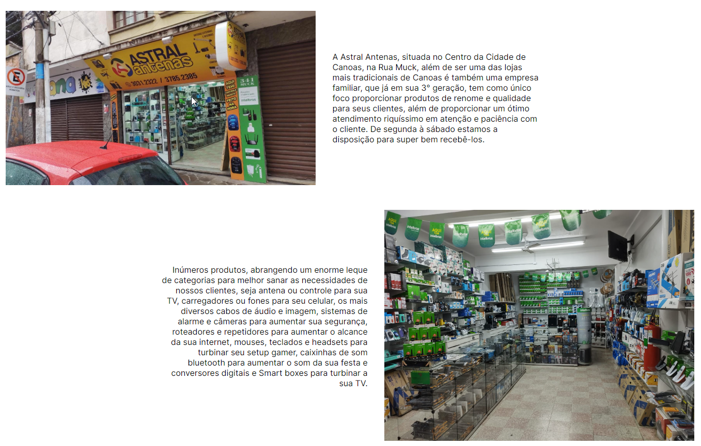
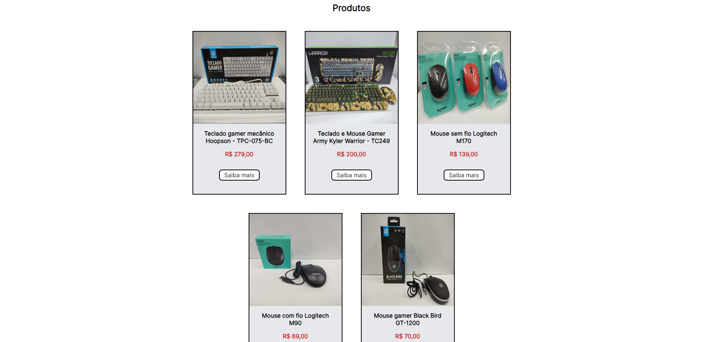
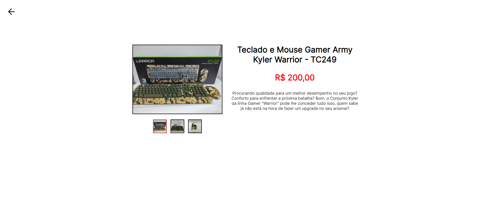
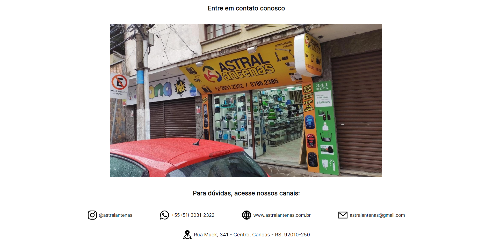
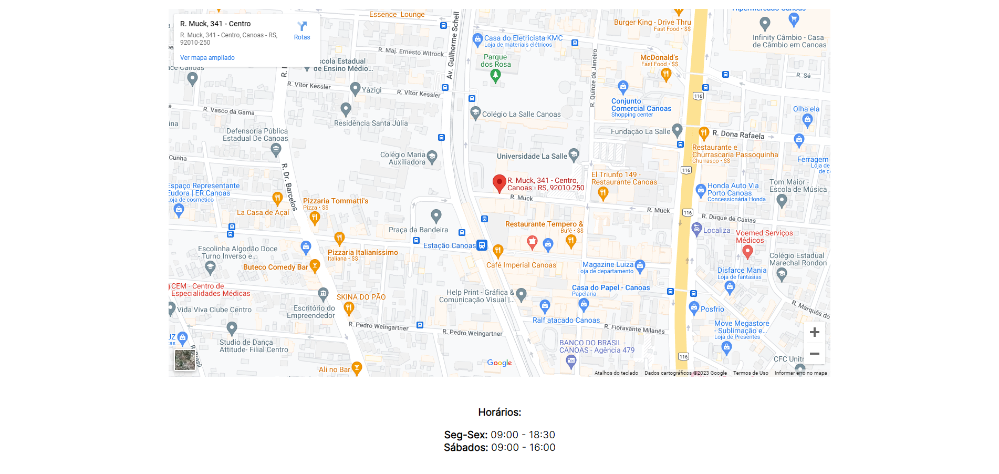

# 📶 Astral Antenas📡

## Resumo ℹ️

Projeto realizado em uma disciplina extensionista proporcionada pela Universidade La Salle, a qual tinha o objetivo de criar algo, envolvendo tecnologia, com o intuito de auxiliar uma empresa em um problema. A loja Astral Antenas, situada no centro de Canoas - RS, que foi parceira do projeto, relatou a necessidade de um site para servir de portfólio dos principais produtos vendidos na loja e também para dar um destaque aos produtos que não eram vendidos frequentemente. 

[🔗 Acesse o projeto aqui](https://astralantenas-production.up.railway.app/)

## Tecnologias 🧰

Aqui estão as tecnologias utilizadas no projeto.

* HTML
* CSS
* JavaScript
* PHP
* Composer
* Laravel
* MySQL
* Git

## Hospedagem/Banco de dados
* Railway

## Site 🌐

### 1 - Menu 📌
* Está presente em todas as páginas do site.

### 2 - Início 🐣
* Conta um pouco da história da loja.

### 3 - Produtos 🛍️
* Contém 30 produtos no total divididos em 6 páginas com 5 produtos cada.

### 4 - Produto Específico 👀
* Mostra informações mais detalhadas do produto, o qual foi escolhido ao clicar no botão "Saiba mais" no card da página Produtos.

### 5 - Contato 📞
* Mostra o Instagram, WhatsApp e E-commmerce da loja, e-mail, horários de funcionamento e endereço (com mapa do Google Maps interativo)

